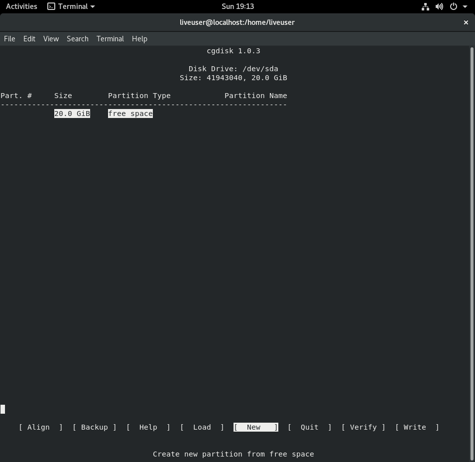
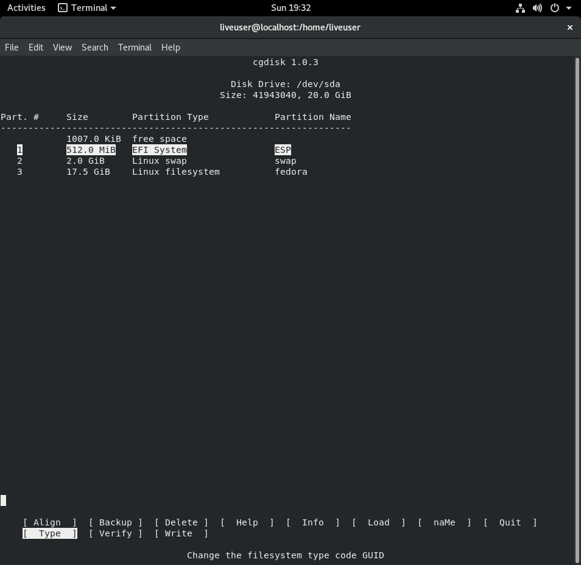

# Pre Installation

Download required scripts

    $ wget https://github.com/glacion/genfstab/releases/download/1.0/genfstab; chmod +x genfstab

## Partitioning

For this VM we will have 3 partitions for `/`, `/boot` and `swap`.

* `/` partition will use `ext4`
* `/boot` is the ESP(EFI System Partition) of our system, therefore it will use `fat32`.
* `swap` is well... `swap`

### Determine the name of your drive

Output of the below command gives us information about the bulk devices(Hard Drives etc.).

    $ lsblk
    NAME        MAJ:MIN RM  SIZE RO TYPE MOUNTPOINT
    loop0         7:0    0  1.6G  1 loop
    loop1         7:1    0  6.5G  1 loop
    ├─live-rw   253:0    0  6.5G  0 dm   /
    └─live-base 253:1    0  6.5G  1 dm
    loop2         7:2    0   32G  0 loop
    └─live-rw   253:0    0  6.5G  0 dm   /
    sda           8:0    0   20G  0 disk
    sr0          11:0    1  1.7G  0 rom  /run/initramfs/live

In this example `sda` is our Hard Drive, output of `lsblk` omits the `/dev/` path, so we will be using `/dev/sda` for our operations.

### Creating GUID Partition Table and Partitions Using `cgdisk`

Running `# cgdisk /dev/sda` gives us an error like;

    Warning! Non-GPT or damaged disk detected! This program will attempt to
    convert to GPT form or repair damage to GPT data structures, but may not
    succeed. Use gdisk or another disk repair tool if you have a damaged GPT
    disk.

This is safe to ignore as in this case, our hard drive doesn't actually contain a partition table.

This probably won't be the case in real-world scenarios. Though if you'd like to nuke your partition table(s), you can run `sgdisk -Z /dev/sda`.

After that this screen will greet us;

In this screen we will create our partitions by selecting `[New]` option for each partition;

    #ESP
    First Sector: Leave This Blank
    Size in sectors: 512M
    Hex Code: EF00
    Enter new partition name: ESP

    #Swap
    First Sector: Leave This Blank
    Size in sectors: 2G
    Hex Code: 8200
    Enter new partition name: swap

    #Root
    First Sector: Leave This Blank
    Size in sectors: Leave This Blank
    Hex Code: Leave This Blank
    Enter new partition name: fedora

The end result should look like this;

After you're done; press `[Write]`, type `yes` to the prompt, and quit `cgdisk`.

## Creating and Mounting the Filesystems

Now that we have our partitions, it is time to put filesystems on them.

**Note:** It is **not** necessary for the partition names we defined in `cgdisk` to match the filesystem labels we are going to use below, feel free to change them according to your needs.

* ESP (EFI System Partition)

    Create a `FAT32` filesystem on `/dev/sda1` with the label `ESP`.

      # mkfs.vfat /dev/sda1 -n ESP

* Swap Partition

    Create swap on `/dev/sda2` with label `swap`.

      # mkswap /dev/sda2 -L swap

* Root Partition

    Create an `ext4` filesystem on `/dev/sda3` with label `fedora`.

      # mkfs.ext4 /dev/sda3 -L fedora

Now we have some filesystems ready to use. It's time to mount them.

* Mount our root partition on /mnt.

      # mount /dev/sda3 /mnt

* Let the system know that swap will be here.

      # swapon /dev/sda2

* Create the mountpoint for our ESP and mount the ESP.

      # mkdir /mnt/boot
      # mount /dev/sda1 /mnt/boot

After this your `lsblk` output should look like this;

    $ lsblk
    NAME        MAJ:MIN RM  SIZE RO TYPE MOUNTPOINT
    loop0         7:0    0  1.6G  1 loop
    loop1         7:1    0  6.5G  1 loop
    ├─live-rw   253:0    0  6.5G  0 dm   /
    └─live-base 253:1    0  6.5G  1 dm
    loop2         7:2    0   32G  0 loop
    └─live-rw   253:0    0  6.5G  0 dm   /
    sda           8:0    0   20G  0 disk
    ├─sda1        8:1    0  512M  0 part /mnt/boot
    ├─sda2        8:2    0    2G  0 part [SWAP]
    └─sda3        8:3    0 17.5G  0 part /mnt
    sr0          11:0    1  1.7G  0 rom  /run/initramfs/live

## Installing The System

After we are done partitioning; we can finally install the base system onto our new partitions.

    # dnf install --installroot=/mnt --releasever=29 --setopt=install_weak_deps=False glibc-langpack-en rtkit file deltarpm @Core

Confirm the prompts when asked.

Let's break down what this command does;

* `--installroot=/mnt` treat `/mnt` as the installation root.
* `--releasever=29` use Fedora 28 as target release, use `rawhide` if you want a 'rolling release' Fedora.
* `--setopt=install_weak_deps=False` don't install weak dependencies(`--no-install-recommends` on Debian), more info about these switches can be found [here](https://dnf.readthedocs.io/en/latest/conf_ref.html)
* `glibc-langpack-en` English langpack for glibc, in order to have a localized system install `glibc-langpack-<LANGCODE>` if no langpack is specified to install, dnf will install `glibc-all-langpacks` package which costs a whopping 100MB alone compared to installing them seperately which costs around 1MB per langpack.
* `rtkit`, `file`, `deltarpm` See `dnf info <PACKAGE_NAME>` for details.
* `@Core` is a small set of packages that's sufficient enough for the system to function.

## Configuration

* Configure the system locale, keymap, timezone, hostname and setup machine id on your new system, usage given below;

      # systemd-firstboot \
      --root=/mnt \
      --locale=<LOCALE> \
      --keymap=<KEYMAP> \
      --timezone=<TIMEZONE> \
      --hostname=<HOSTNAME> \
      --setup-machine-id

    Example;

      # systemd-firstboot \
      --root=/mnt \
      --locale=en_US.UTF-8 \
      --keymap=tr-intl \
      --timezone=Europe/Istanbul \
      --hostname=fedora \
      --setup-machine-id

    Keep in mind that you can always copy the configuration that's in the live system you're running, or let the tool prompt for each of them so you can select from a list if you don't know the names you're going to use. See `systemd-firstboot --help` for details.

* Generate fstab

      # ./genfstab -L /mnt >> /mnt/etc/fstab

    We generate the fstab file and save it in our new system.

    `-L` switch tells `genfstab` to use labels for partitions, use `-U` instead if you want to use UUIDs instead. see `genfstab --help` for details.

* Chroot to Our New Installation

      # systemd-nspawn -D /mnt

* Create a new user and give it a password

      (chroot) useradd -c "YOUR_FULL_NAME" -m -g users -G wheel -s /bin/bash YOUR_USERNAME
      (chroot) passwd YOUR_USERNAME

* Exit and boot the system as a container

      # systemd-nspawn -bD /mnt
    
    Login with the credentials you just created.

* Selinux

    To recreate the SELinux Labels issue this command, omitting to do this causes selinux to fail most of the system's capabilities.

      fixfiles -F onboot
      
## Cleanup

Even though the system we installed is pretty minimal, there's always more room to clean up.

Note: Removing these packages are **not** required to have a functioning system, and the packages we are going to remove **can** break some functionality that you may need, proceed with caution.

    (chroot) dnf remove dracut-config-rescue grubby man-db openssh-server parted sssd-common

## Bootloader

We'll be using `systemd-boot` formerly known as `gummiboot`, instead of GRUB.

1. Installing `systemd-boot`

       (chroot) bootctl install

2. Install the Kernel

       (chroot) dnf install kernel

    We need to fix boot parameters. After installing the kernel, the auto-generated entry uses the boot parameters of the live system. The entry exists in `/boot/loader/entries/<MACHINE_ID>-<KVER>.conf`

    Example;

       (chroot) vi /boot/loader/entries/52f380e6dcad40e28eb396d515d4e16d-4.17.18-200.fc28.x86_64.conf

    We need to fix the `options` field in this file from;

       options    BOOT_IMAGE=/images/pxeboot/vmlinuz root=live:CDLABEL=Fedora-WS-Live-28-1-1 rd.live.image quiet

    to;

       options    root=LABEL=fedora ro rhgb quiet

    If the `.conf` file doesn't appear in the directory, issue `dnf reinstall kernel-core` command.
    

3. Reboot
    Now that we're done with our bootloaders, we can reboot to our new installation.

    If you manually mounted `/etc/resolv.conf`, run `# umount /mnt/etc/resolv.conf` now.

       (chroot) exit
       # umount -R /mnt
       $ reboot

## Post-Install Checks

To confirm everything went correctly, we'll check the following items;

* The output from `$ systemctl status` should show State as `running`.
* `$ ping google.com` should work fine.
* `$ getenforce` should return 'Enforcing'
* `$ reboot` should work fine.

If all is well, you're done!
